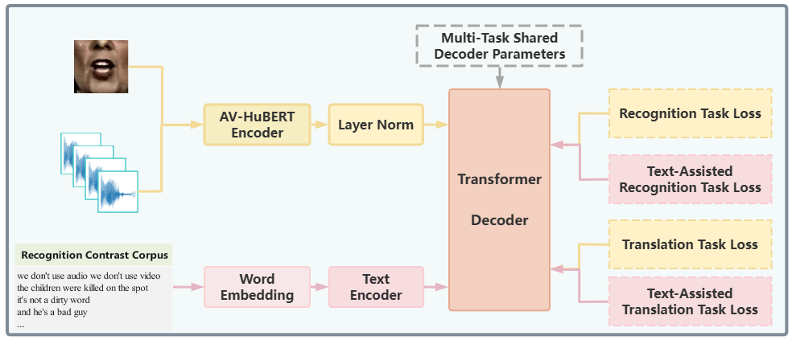
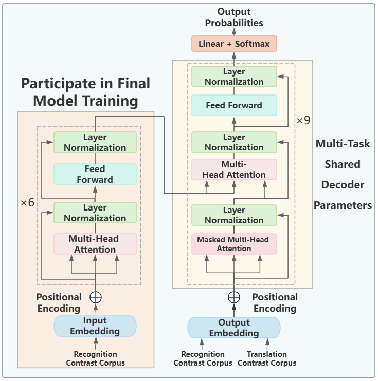

# TAVNet: Text-aided Audio-Visual Network for Speech Recognition and Translation

This repository contains the **TAVNet** model code, which includes multiple model variants for speech recognition and translation tasks using audio and video inputs. Below is a detailed description of the folder structure:

## Folder Descriptions

- hubert 

  Contains implementations related to **HuBERT** for audio feature extraction.

- avtnet

  The baseline model for performing speech recognition and translation tasks using audio and video inputs.

- avtnet_deltalm

  A model leveraging the pre-trained text translation model **DeltaLM** to assist with training.

- large_noise_no_transformer

  A model designed for dual speech recognition and translation tasks using audio and video inputs in noisy environments, without Transformer pre-training.

- **`avtnet_noise_large_transformer`**  
  Our final proposed model in the paper. This model employs a multi-task pre-trained Transformer to enhance audio and video inputs for speech recognition and translation tasks in noisy environments.

- Source
  Contains project-related resources, such as model architecture diagrams.

---

## Model Architecture

### TAVNet Model Architecture
The diagram below illustrates the architecture of our **TAVNet** model:



### Multi-task Text Pre-training Model
The diagram below shows the architecture of our pre-trained multi-task text model:



---

## Data Preparation

Refer to [AV-HuBERT Data Preparation](https://github.com/facebookresearch/av_hubert/tree/main/avhubert/preparation) for guidance.

```bash
cd avtnet_noise_large_transformer/preparation
```

To facilitate data handling, audio files are converted into .npy files:
```bash
bash save_npy.sh
```


### Preparing the Dictionary
Navigate to the following directory:
```bash
cd avtnet_noise_large_transformer/preparation
```
When generating the dictionary, ensure that multi-task text data is combined into a single file to create a **mixed dictionary**.

For English text preparation, run the script lrs3_manifest.sh:

For English text preparation, run the script [lrs3_manifest.sh](avtnet_noise_large_transformer\preparation\script\lrs3_manifest.sh)
```bash
bash lrs3_manifest.sh
```
For Chinese text preparation, run the script [lrs3_manifest_cn.sh](avtnet_noise_large_transformer\preparation\script\lrs3_manifest.sh)
```bash
bash lrs3_manifest_cn.sh
```
To generate the mixed dictionary, run the script [preparaing.sh](avtnet_noise_large_transformer\preparation\script\preparaing.sh)
```bash
bash preparaing.sh
```

## Model Training

First, pre-train the text model:
```bash
cd avtnet_noise_large_transformer
```
```bash
bash scripts/train_t.sh
```
Then, train the TAVNet model:
```bash
bash scripts/train.sh
```
## Model Inference

For speech recognition inference:
```bash
bash scripts/generate.sh
```
For translation task inference:
```bash
bash scripts/generate_st.sh
```